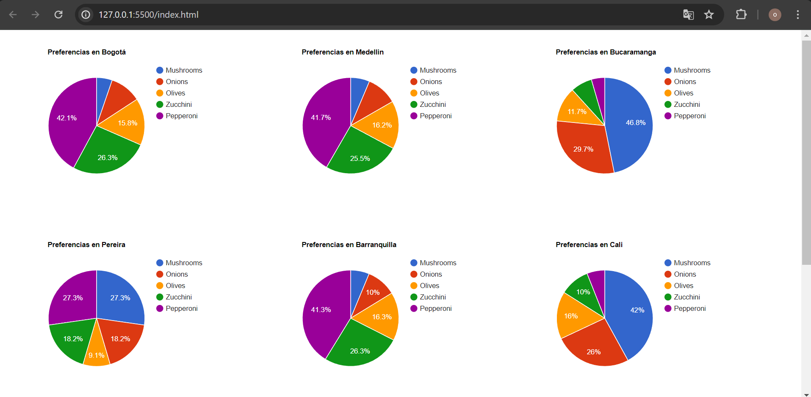

# Google Charts API Javascript Client
Adaptación del código de Google Charts para uso masivo en la generación de gráficos circulares. Recibe los datos como un objeto.
El código ha evolucionado a una programación por módulos de Javascript, 
esto lo hace más amigable al desarrollador a la hora de implementarlo para
reutilizar el código facilmente, en diversos proyectos.

## Gestión realizada:

### Uso masivo de generación de gráficos circulares
Adaptación del código para uso masivo en la generación de gráficos circulares.  
Recibe los datos como un objeto. 



> "Google Charts proporciona una manera perfecta de visualizar datos en tu sitio web.
> Desde gráficos de líneas simples hasta mapas jerárquicos complejos. La galería de
> gráficos proporciona una gran cantidad de tipos de gráficos listos para usar."  
> Fuente: https://developers.google.com/chart/interactive/docs?hl=es-419

### Estabilización del código para consultar datos de una hoja de cálculo de Google

En la documentación de google, se dice lo siguiente:

> "A continuación, se muestran dos maneras de dibujar este
> gráfico: una usa el parámetro gid y la otra usa el parámetro
> sheet. Si ingresas cualquiera de las URL en el navegador, se
> producirán los mismos resultados o datos para el gráfico."  
> https://developers.google.com/chart/interactive/docs/spreadsheets?hl=es-419#gid

Sin embargo, el código está incompleto, y se da por sentado que el desarrollador
descubrirá por sí mismo el modo de usarlo. Dada la necesidad, aqui publico el siguiente código para aclarar dudas al respecto.

### GID - Usa el parámetro gid

<b>./js/drawGid.js</b>

```Javascript

google.charts.load('current', { packages: ['corechart'] });
google.charts.setOnLoadCallback(drawGID);

function drawGID() {
  const queryString = encodeURIComponent('SELECT A, H, O, Q, R, U LIMIT 5 OFFSET 8');
  const query = new google.visualization.Query(
    'https://docs.google.com/spreadsheets/d/1XWJLkAwch5GXAt_7zOFDcg8Wm8Xv29_8PWuuW15qmAE/gviz/tq?gid=0&headers=1&tq=' + queryString);
  query.send(handleQueryResponse);
}

function handleQueryResponse(response) {
  if (response.isError()) {
    alert('Error in query: ' + response.getMessage() + ' ' + response.getDetailedMessage());
    return;
  }

  const data = response.getDataTable();
  const chart = new google.visualization.ColumnChart(document.getElementById('chart_div'));
  console.log(data)
  chart.draw(data, { height:400 });
}

```

<b>./drawGid.html</b>

```HTML

<!DOCTYPE html>
<html>

<head>
  <title>Draw GID</title>
  <meta charset="UTF-8">
  <meta name="viewport" content="width=device-width, initial-scale=1.0">
  <script src="https://www.gstatic.com/charts/loader.js"></script>
  <script type="module" src="./js/drawGid.js"></script>
</head>

<body>
  <div id="chart_div"></div>
</body>

</html>

```


### Hoja - Usa el parámetro sheet

<b>./js/drawSheetName.js</b>

```Javascript

google.charts.load('current', { packages: ['corechart'] });
google.charts.setOnLoadCallback(drawSheetName);

function drawSheetName() {
    var queryString = encodeURIComponent('SELECT A, H, O, Q, R, U LIMIT 5 OFFSET 8');

    var query = new google.visualization.Query(
        'https://docs.google.com/spreadsheets/d/1XWJLkAwch5GXAt_7zOFDcg8Wm8Xv29_8PWuuW15qmAE/gviz/tq?sheet=Sheet1&headers=1&tq=' + queryString);
    query.send(handleSampleDataQueryResponse);
}

function handleSampleDataQueryResponse(response) {
    if (response.isError()) {
        alert('Error in query: ' + response.getMessage() + ' ' + response.getDetailedMessage());
        return;
    }

    var data = response.getDataTable();
    var chart = new google.visualization.ColumnChart(document.getElementById('chart_div'));
    chart.draw(data, { height: 400 });
}
```

<b>./drawSheetName.html</b>

```HTML

<!DOCTYPE html>
<html lang="en">

<head>
    <meta charset="UTF-8">
    <meta name="viewport" content="width=device-width, initial-scale=1.0">
    <title>Spreadsheets</title>
    <script src="https://www.gstatic.com/charts/loader.js"></script>
    <script type="module" src="./js/drawSheetName.js"></script>
</head>

<body>
    <div id="chart_div"></div>
</body>

</html>
```

## Fuente estudiada para el desarrollo:  
<b>Google Charts - Inicio rápido:</b>  
https://developers.google.com/chart/interactive/docs/quick_start?hl=es-419


<b>Usar hojas de cálculo de Google como fuente de datos:</b>
https://developers.google.com/chart/interactive/docs/spreadsheets?hl=es-419#gid
